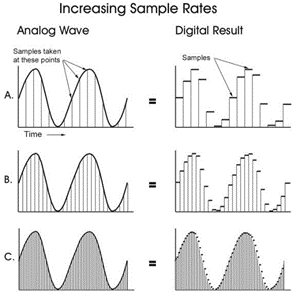
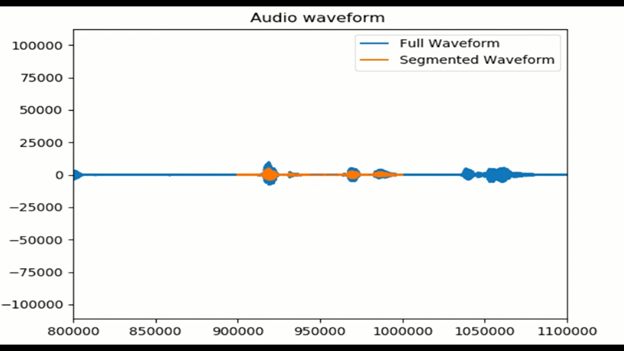
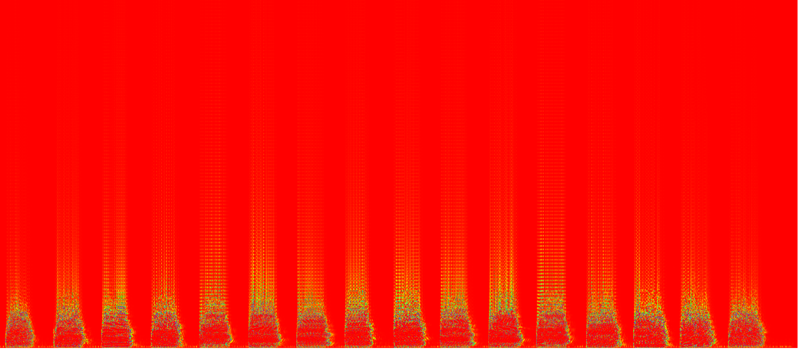
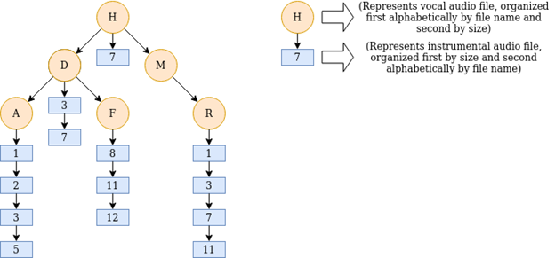

# Project Overview

The Musical Speech Isolation and Conversion Automation (Mu.S.I.C.A) Project spanned the winter and spring semesters of 2021. The Mu.S.I.C.A Project was a self-driven project to gain experience with C++ programming, explore interests in machine learning, and develop applied engineering skills. The objective of this project is to design a program that analyses musical audio and extracts frequency data in order to develop a dataset for vocal isolation. 

This dataset is being created in order to address the following question: <br>

  ***Can audio data be used to predictively reconstruct a song in a new language?***
<br>

This project completes three primary tasks: <br/>
1. Read (write, and play) music .wav files
2. Extract music frequency data and construct spectrograms
3. Create musical dataset for vocal and non vocal audio frequency data

Project Primary Dependencies: <br/>
- FFmpeg
- SDL
- MatplotLib (C++)
- OpenCV

# Project Motivation

This project was inspired by my interest in the process of learning spoken language, the topic of translation technology, and my desire to improve my engineering and programming skills. Furthermore, this project expands upon work done for a Complex Leadership Challenges course where I researched and proposed a solution for a robust translation technology program. The goal of this project is to explore the broad topic of automatic speech recognition and get exposure to topics such as computational linguistics, feature extraction, ant machine learning. 

In addition to multiple learning goals for technical skills, my goals for this experience also included embracing active learning, pushing my comfort zone, and developing strong reflection habits.

# Phase I: Data Collection and Data Preparation ([View Code](https://github.com/bruceble/Mu.S.I.C.A./tree/main/PhaseI))
The purpose of Phase I was to collect raw data and perform data preparation methods in order to satisfy a predifined machine-learning model for vocal-isolation. The following sections describe key functionalities needed to collect and prepare adequate data. 

## Raw Data Collection
The initial data was obtained from downloaded music from YouTube. The raw data was targeted to meet one of the following two criteria:
- Non-Vocal (i.e. instrumental audio)
- Vocal (i.e. acapella) 
<br>
All audio files were stored as .wav files. 

## Extracting Audio Data
 <br/>
[Figure 1: Sampled Audio Data](https://www.izotope.com/en/learn/digital-audio-basics-sample-rate-and-bit-depth.html)<br/>
In order to store audio (and ultimately read data), several parameters must be defined: 
<br/>
**Typical Sampling Rates**
- 11 kHz
- 22 kHz
- 44 kHz

**Typical Sample Data Types**
- uint8/16/32
- sint8/16/32

For this project, .wav file sampling rate was 44kHz and data type was uint16.

## Visualizing Audio Data (Time Domain)
Visualizing the time domain waveform primarily serves to verify that the read-in audio data appears as it was expected and can be modified. The waveforms could be compared to audio programs such as Audacity.
After considering several plotting options for C++, the library chosen was [matplotlib-cpp](https://github.com/lava/matplotlib-cpp). 
Given the disproportionality between the number of audio samples and the amplitude of the audio data, the full waveform typically would appear a flat line. In order to visualize audio data with better amplitude resolution, a segmented waveform was defined by a smaller length of data samples. The segment's amplitude was also halved to verify that the audio could be modified in code. Then an animated plot that traversed through the waveform with a closer viewing window. A snapshot of the animated audio waveform graph can be seen below. 



## Visualize Musical Data (Frequency Domain)
### Discrete Fourier Transform
The fourier transform is a mathematical analysis of time-varying spectral characteristics and its application ranges from speech to music to seismology.
<br/>

<br/>
For the purpose of this project, x(t) represents the audio signal level at a given point in time: t. X(k) represents the audio signal level at a given frequency: k.  
<br/>
Rather than implementing a DFT in code from scratch, the dft() function was used from the OpenCV library. 

### Constructing a Spectogram (STFT)
A spectrogram is a visual representation of how a signals frequency and phase characteristics change over time. This is performed mathematically by performing a series of DFTs in smaller time-steps along the duration of the signal rather than performing a single DFT over the entire signal (Fast Fourier Transform). The spectrogram constructed by iterating through an audio signal of a trombone playing a musical scale, and performing DFTs to extract frequency data. This data is then assigned RGB values based on the intensity (magnitude) of each frequency. The corresponding spectrogram is seen below in the Results section.

#### Spectogram: Trombone b-flat scale 


### Hanning Window
For more dynamic audio, a hanning window was applied to smoothen the frequency data and create a clearer spectogram image. 

```c
/* Hanning Window Pseudocode */
double alpha = 0.5;
double pi = 3.1415926;
for(i<N){
  w.at(i) = alpha*(1-cos(2*pi*i/N)); // window function
  y.at(i) = y.at(i)*w.at(i);
}
```

#### Spectogram without Hanning Window


#### Spectogram with Hanning Window


# Phase II: "VIsoMod" ([View Code](https://github.com/bruceble/VIsoMod))
The purpose of Phase II was to organize and store data for future projects. The following sections describe the method used for creating the dataset and the format of the dataset. 

## Creating the Dataset
For the Mu.S.I.C.A data set, I decided to implement a tree structure with linked lists to organize this data set. The tree structure organizes the audio data based on the filename of the vocal data used (and file size if the filenames match), and each vocal tree node would contain a linked-list of all the non-vocal audio data that respective audio was mixed with, organized by file size (and file name if sizes match). 
<br/>
For example, the tree node “A” represents a vocal audio file that starts with the letter a, and it has been mixed with non vocal files numbered 1, 2, 3, and 5. 
<br>

<br>
As each vocal tree node was added to the tree, the STFT functionality created in Phase I was implemented and the corresponding frequency data was stored within the corresponding node. This process was repeated for each non-vocal linked-list node. Additionally, the vocal tree node also stored a binary value indicating whether or not a frequency bin contains vocal content (non-zero frequency magnitude). 

## Dataset Format
For each timestep of the mixed audio, a DFT was calculated for 513 different frequency bins. Furthermore, each DFT was grouped together in groups of 25 in order to retain temporal context. As a result, each individual sample set requires 12,825 (513x25) values. This will serve as the initial input for training a future maching learning model.

Likewise, each time step of the vocal-only audio calculated DFT for the same amount of frequency bins. Rather than using the frequency for the dataset, the binary indicator for vocal content was used. For a given 25-frame mixed-audio set, the corresponding vocal-only binary set will contain (513x1) values representing the middle (12th) frame of the 25-grouped temporal context. 

# Project By-The-Numbers
**Phase 0: Winter C++ Bootcamp:** 25+ hours <br/>
**Phase I: Testing and Visualization:** 88 hours <br/>
**Phase II: Vocal-Isolation Dataset:** 60 hours <br/>
**Concurrent Data Structures Course:** 5-6 hours a week x 15 weeks <br/>
