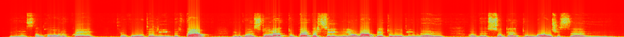

# Project Overview

The Musical Speech Isolation and Conversion Automation (Mu.S.I.C.A) Project spanned the winter and spring semesters of 2021. The Mu.S.I.C.A Project was a self-driven project to gain experience with C++ programming, explore interests in machine learning, and develop applied engineering skills. The objective of this project is to design a program that analyses musical audio and extracts frequency data in order to develop a dataset for vocal isolation. 

This project completes three primary tasks: <br/>
1. Read (write, and play) music .wav files
2. Extract music frequency data and construct spectrograms
3. Create musical dataset for vocal and non vocal audio frequency data

Project Primary Dependencies: <br/>
- FFmpeg
- SDL
- MatplotLib (C++)
- OpenCV

# Project Motivation

This project was inspired by my interest in the process of learning spoken language, the topic of translation technology, and my desire to improve my engineering and programming skills. Furthermore, this project expands upon work done for a Complex Leadership Challenges course where I researched and proposed a solution for a robust translation technology program. The goal of this project is to explore the broad topic of automatic speech recognition and get exposure to topics such as computational linguistics, feature extraction, ant machine learning. 

In addition to multiple learning goals for technical skills, my goals for this experience also included embracing active learning, pushing my comfort zone, and developing strong reflection habits.

# Project By-The-Numbers
**Phase 0: Winter C++ Bootcamp:** 25+ hours <br/>
**Phase I: Testing and Visualization**:88 hours <br/>
**Phase II: Vocal-Isolation Dataset**:60 hours <br/>
**Concurrent Data Structures Course**:5-6 hours a week x 15 weeks <br/>


# Phase I
## Read, Write, Play Audio
 <br/>
[Figure 1: Sampled Audio Data](https://www.izotope.com/en/learn/digital-audio-basics-sample-rate-and-bit-depth.html)<br/>
In order to store audio (and ultimately read data), several parameters must be defined: 
<br/>
**Typical Sampling Rates**
- 11 kHz
- 22 kHz
- 44 kHz

**Typical Sample Data Types**
- uint8/16/32
- sint8/16/32

For this project, .wav file sampling rate was 44kHz and data type was uint16.

# Visualize Musical Data (Time Domain)
## Methodology
Visualizing the time domain waveform primarily serves to verify that the read-in audio data appears as it was expected and can be modified. The waveforms could be compared to audio programs such as Audacity.
After considering several plotting options for C++, the library chosen was [matplotlib-cpp](https://github.com/lava/matplotlib-cpp). 
Given the disproportionality between the number of audio samples and the amplitude of the audio data, the full waveform typically would appear a flat line. In order to visualize audio data with better amplitude resolution, a segmented waveform was defined by a smaller length of data samples. The segment's amplitude was also halved to verify that the audio could be modified in code. Then an animated plot that traversed through the waveform with a closer viewing window. A snapshot of the animated audio waveform graph can be seen below in the Results section. 
## Results


# Visualize Musical Data (Frequency Domain)
## Methodology
### Discrete Fourier Transform
The fourier transform is a mathematical analysis of time-varying spectral characteristics and its application ranges from speech to music to seismology.
<br/>

<br/>
For the purpose of this project, x(t) represents the audio signal level at a given point in time: t. X(k) represents the audio signal level at a given frequency: k.  
<br/>
Rather than implementing a DFT in code from scratch, the dft() function was used from the OpenCV library. 

### Constructing a Spectogram (STFT)
A spectrogram is a visual representation of how a signals frequency and phase characteristics change over time. This is performed mathematically by performing a series of DFTs in smaller time-steps along the duration of the signal rather than performing a single DFT over the entire signal (Fast Fourier Transform). The spectrogram constructed by iterating through an audio signal of a trombone playing a musical scale, and performing DFTs to extract frequency data. This data is then assigned RGB values based on the intensity (magnitude) of each frequency. The corresponding spectrogram is seen below in the Results section.

## Results


### Hanning Window
For more dynamic audio, a hanning window was applied to smoothen the frequency data and create a clearer spectogram image. 

#### Spectogram without Hanning Window


#### Spectogram with Hanning Window


```c
/* Hanning Window Pseudocode */
double alpha = 0.5;
double pi = 3.1415926;
for(i<N){
  w.at(i) = alpha*(1-cos(2*pi*i/N)); // window function
  y.at(i) = y.at(i)*w.at(i);
}
```

# Phase II
## Creating the Dataset
